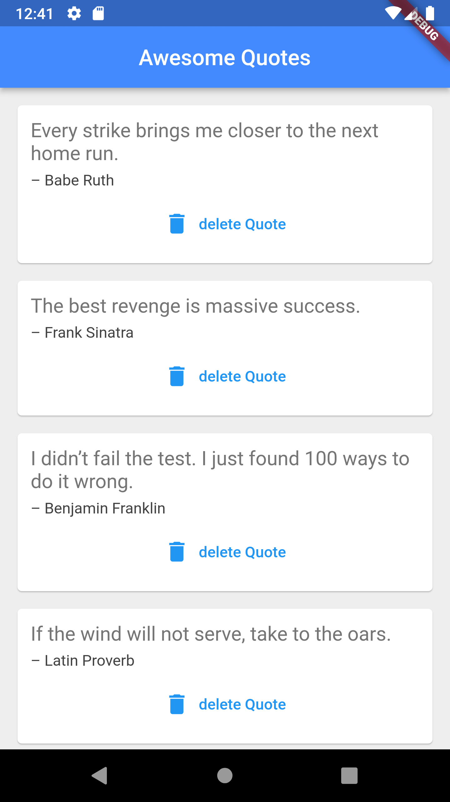

# Quotes App
A flutter app that shows quotes.
You can install the app by going to release section of the github repository and downloading the apk file.
Or you can directly click on [this link](https://github.com/ImaginedTime/quotes-app-flutter/releases/download/app/Quotes-v1.0.0.apk)

### Below is the picture of the working app

    

# qoutes

A new Flutter project.

## Getting Started

This project is a starting point for a Flutter application.

A few resources to get you started if this is your first Flutter project:

- [Lab: Write your first Flutter app](https://docs.flutter.dev/get-started/codelab)
- [Cookbook: Useful Flutter samples](https://docs.flutter.dev/cookbook)

For help getting started with Flutter development, view the
[online documentation](https://docs.flutter.dev/), which offers tutorials,
samples, guidance on mobile development, and a full API reference.
